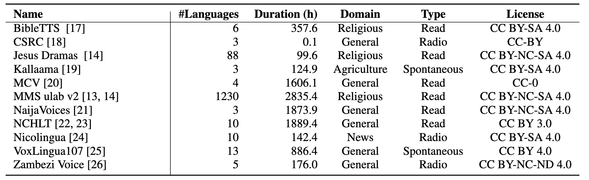

# AfriHuBERT: A self-supervised speech representation model for African languages

<a href='https://arxiv.org/abs/2409.20201'></a>

## Introduction
This is the code for the AfriHuBERT submitted to the [Interspeech 2025](https://arxiv.org/abs/2409.20201). AfriHuBERT is a compact multilingual self-supervised speech encoder based on mHuBERT-147. We performed continued pretraining through multilingual adaptive finetuning (MAFT) on over 10,000 hours of African languages' data aggregated from various sources. This model can be considered the fourth iteration of mHuBERT-147, specifically trained on African languages. According to the paper, this is the **AfriHuBERT-*n*** model. You can click [here](https://huggingface.co/ajesujoba/AfriHuBERTo) for the **AfriHuBERT-*o*** model.


## Pretraining data
- Dataset: AfriHuBERT was trained on data from 11 major sources, including BibleTTS, Kallaama, MMS Ulab v2, NaijaVoices, and NCHLT. All sources and their licenses are shown in the table below. Please refer to the paper for more information. 


### Language Coverage
AfriHuBERT covers 1,230 languages in total including 1,226 indigenous African languages

### BibTeX entry and citation info.
```
@misc{alabi2024afrihubertselfsupervisedspeechrepresentation,
      title={AfriHuBERT: A self-supervised speech representation model for African languages}, 
      author={Jesujoba O. Alabi and Xuechen Liu and Dietrich Klakow and Junichi Yamagishi},
      year={2024},
      eprint={2409.20201},
      archivePrefix={arXiv},
      primaryClass={cs.CL},
      url={https://arxiv.org/abs/2409.20201}, 
}

```
